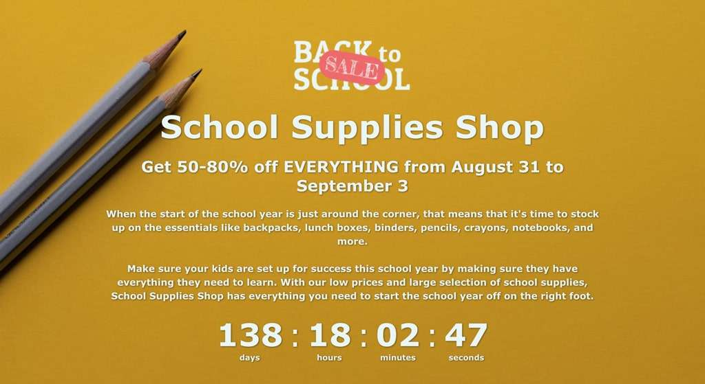
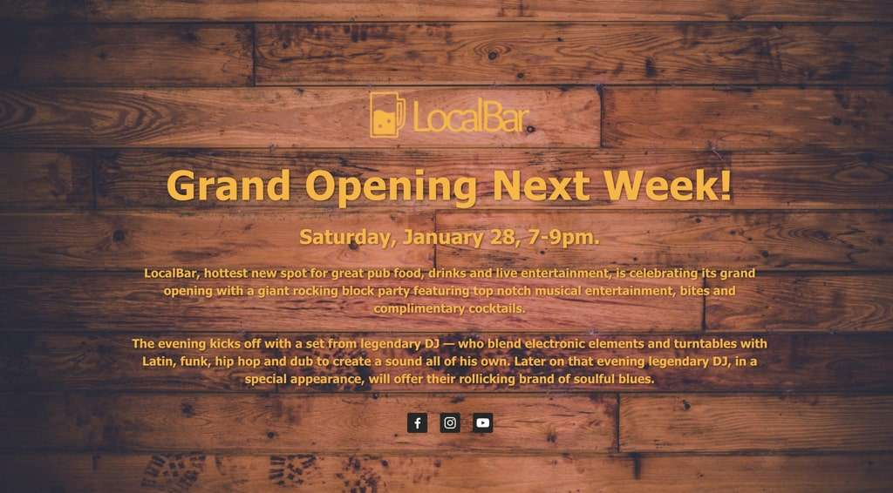
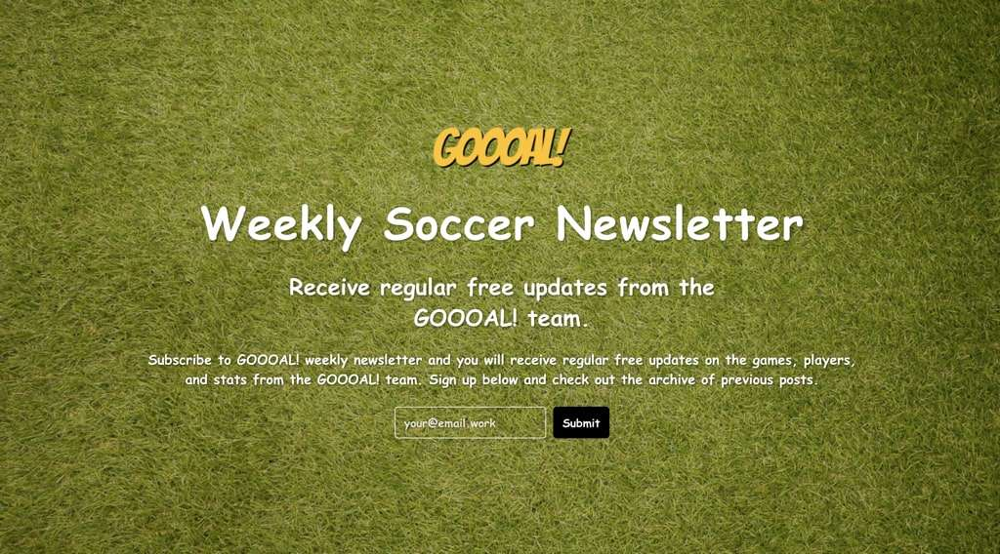
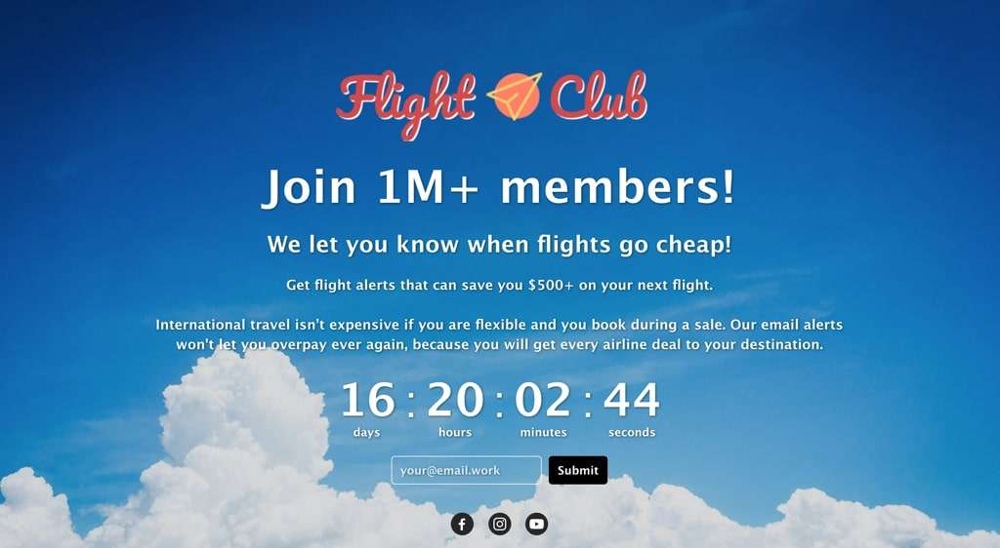

## TL;DR

Hello, how was your week? My week went horribly with the wrong marketing assumptions, followed by anxiety. On the bright side, templates feature for StaticPage is almost ready for release with 4 templates. Now, ready to retrospec and move forward.

## What Am I Doing?

During the week some of you expressed concern on the subject of **we are happy for you but what the hell are you doing?!** Thanks for asking and sorry for not being clear about it. I'm doing two things, here they are:

**First thing**, Making \*landing pages for a living. If you need a landing page built, let me know I'm your guy!

**Second thing**, building a product named **StaticPage**. A landing page builder like Wix but better! How better? It takes fewer steps to create a landing page with it. You can download the code and host the landing page wherever you want. Another advantage, you get support from me as quickly as humanly possible and not from a corporate middle man.

\*Landing page is a web page that a business owner wants to drive people to. This web page can be: new website opening, sale for a holiday, product release, etc…

## Thanks for Reading

Let's continue with the most important subject, your numbers. The newsletter sent to 140 people on last Monday and until today it achieved:

- 63 (46.7%) opened.
- 4 (6.3%) replied.
- 3 (2.2%) clicked on links.
- 3 (100%) subscribed to the landing page.
- 6 (4.2%) unsubscribed.

Interesting to see what's the numbers will be this week.

## Failed Marketing Assumptions

Before starting StaticPage marketing, when someone would ask me about "how would I market StaticPage to the right audience?". I would brag that it's simple. My audience is freelancers. So, I just need to sign up to the freelance marketplaces and send them a message. They will love StaticPage!

**Boy, I was wrong**. I have signed up to 3 freelance marketplaces and not only my messages weren't appealing as much as I thought. Also, I have violated the Terms of Service on all the marketplaces and was blocked.

At the moment I'm trying to think of alternative ways reaching those freelancers. Facebook groups and Twitter came to mind. Do you have any other suggestions?

## Preview of StaticPage Templates

Failing marketing gave me the energy to work on StaticPage's code! I'm proud to release this week a templates feature. Meaning, every time you create a new landing page with StaticPage. You will be able to pick 1 of 4 cool templates to begin with:

**Back to School** template with a Countdown clock

**LocalBar** template with Social Icons

**GOOOAL!** template with a Mailing list

**Flight Club** template with a Countdown clock, Mailing list, and Social Icons.

## Current Week

This week is all about focusing on these things:

- Releasing StaticPage's templates feature.
- Working on a landing page that will explain better what StaticPage is and what I do.

### Still Reading and want to Support Me?

Please subscribe to StaticPage testing mailing list here: ~~bit.ly/GetStaticPage~~ and help win $5k which will help growing StaticPage.

_Until next week_, enjoy and let me know what you think! 🙌
