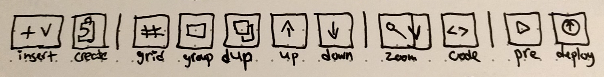

### Hello, how are you doing?

I’m good, thank you! Nothing much to update on this month I’m afraid. Still spreading the word and heading your thoughts on StaticPage as a product and where it should go.

## **New Website!** (~~staticpage.io~~)

Or better yet, an adaptation and expansion of the old. I have wanted to add Blog pages to the website and It took more time than it should off. Here is why:

- Decided to build the Blog on top of Jekyll.
- Decided to move the website to be part of the blog infrastructure rather than StaticPage’s application code.
- Decided to add more pages to the mix (Support and Pricing).

Sometimes the scope of a project gets bigger during the work on it.

## Features are still coming

Sorry, can’t go into the details yet, writing the specs for them as you read those lines. I can show you a small preview of what is coming via a wireframe of a new menu:

Let me know what you think? I would love to discuss it with you!

Meanwhile, have fun and enjoy the day! 🤓
Idan.
