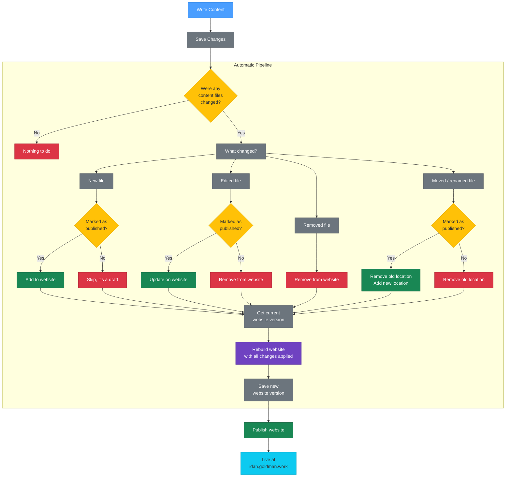

For years, I had developer's block as a writer — trying to build/rebuild/optimize the website, putting my writings aside, chasing the perfect structure worthy enough to exhibit my thoughts, ideas, feelings, and work. All I wanted was a way to write and post the damn thing… yet all I did was code the damn thing, which got me blocked from writing the damn thing again and again. Now, I'm trying a new thing (for me): writing about how to build the damn thing while building the damn thing — dogfooding myself, if you will.

So… my current thesis is: content should be front and center, with everything else kept aside and to a minimum.

## Focus on Content

> *Write > Publish > Read*

Pretty simple, isn't it? While it looks like any other generic content-publishing flow out there, my peace of mind lies in the details — keeping plumbing code out of sight, hidden in a dot folder, while content resides in the git repository's root folder. Let me explain what I mean by that.

In any other SSG/CMS setup, the codebase is front and center and the content is just a folder or database entry that plays its part. I don't like that, because it takes my focus from writing the content to maintaining the codebase, as any other ADHD developer would.

This time, content files are the main focus — as they always should have been — while the code setup files sit in a "hidden" folder at the top of the git repository. That way, when I open the main folder in any editor, the content is right there and not in a side folder a couple of clicks down.

## How it looks

```shell
web/
├─ .forgejo/
├─ about.md
├─ home.md
└─ notebook/
  ├─ april-fools-beginning.md
  ├─ i-want-to-tell-you-a-story.md
  ├─ month-of-flying-by.md
  ├─ public-beta-is-out/
  │  ├─ content.md
  │  ├─ staticpage-logo.png
  │  └─ staticpage-landing-page.png
  ├─ ready-to-go-full-time.md
  ├─ ...
  └─ studio.md
```

Well, what do you think? To my eyes the codebase clutter is gone, and all I'm left with is structured content — files and folders translated into web paths, with some code plumbing underneath, like:

- `about.md` becomes `/about/index.html`
- `home.md` becomes `/index.html`
- `content.md` files inside folders become `index.html`
- Any media files (like images) related to a piece of content live beside it, in a folder named after that piece of content.

## How it works

The hidden piece of code plumbing (the magic) is done inside the `.forgejo` folder. Take a look:

```shell
web/
└─ .forgejo/
  ├─ workflows/
  │  ├─ build.yml
  │  └─ deploy.yml
  └─ quartz/
     ├─ custom.scss
     ├─ quartz.config.ts
     └─ quartz.layout.ts
```

So, what do we have here? `workflows` and `quartz` folders — one for building and deploying the website's content you read here, and the other for the website's configuration and customization you see here.

## Why Forgejo and Quartz?

- **Forgejo** is easy: I already enjoy using it as my self-hosted git server and action runner. It runs blazing fast (in my setup) and has a snappy web UI, which helps.
- **Quartz**… don't know yet, we will see. Seems like it's made for generating websites out of folder-based content structures like *Obsidian*'s, and comes with supporting plugins to make life easier.

## Workflows

The last part of this piece, before I jump into proving my thesis right, is how it all actually comes together — from writing a piece of content, through publishing it, to reading it on this website. The best way for me to explain is with a flowchart. So, here it is:



Yeah, I know it's a bit much for a personal website, and might change later.

## The End

…and that's it, folks — thank you for reading! See you next time.

**P.S.** If you are reading this, the website is already up and this content piece is already outdated on how the actual website got built. Still the same idea — just different tools and workflows.
