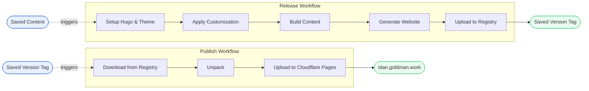

> King Content lived a life of theory, hypothesis, and analysis, and died to live a life of thesis. Long live King Content II.

Ideas are perfect until they meet reality and adjustments must be made as Plan B or C (OK, more like Plan K-L-M-N-O-P). The exact same thing happened to me while writing *[Content is King](/notebook/content-is-king-a-thesis-on-personal-website-architecture/)*. While the theory made perfect sense on paper, in practice it required real-world adjustments to become a thesis. In this field note, I will review what actually worked to keep my focus solely on content while moving the plumbing code aside.

## Plumbing Code

The most significant architectural shift was replacing *Quartz* with *Hugo* and the *Stack* theme. For my specific use case, Hugo is simply a better-matched *SSG*, allowing me to minimize additions and extensions to the codebase.

> *Write > Preview > Publish > Read*

The second major adjustment to the plumbing code was the forgotten step of *previewing* the website before publishing. I needed a way to review the look, feel, and theme of the website before publishing it live, rather than debugging it after the fact. To achieve this, I used *Process Compose* as a lightweight alternative to *Docker Compose*, reusing my existing scripts while keeping *BASH* scripting as the good old glue holding everything together.

For an expand version of tools used to glue the website togather, you can check out the [README.md](https://github.com/idangoldman/web#credit-where-due) on the public *GitHub* repository mirror.

## Structure

On the structural side, the biggest change involved decluttering the notebook folder. I split a single, flat list of files into 3 sub-folders:

1. `archived`: Content from previous website iterations that I still want to keep.
2. `drafts`: Ideas and active writings, which are excluded from the public mirror repository on GitHub, I want to keep an element of surprise — BOO!
3. `published`: Finalized writings live on the current website.

All other changes were minor cleanups of unused assets and content or small migrations to better-suited place for them.

> Content vs. Plumbing Code Ratio: `2:1`

...and instead of boring you with a Git repository tree code block, here is the breakdown of how the repository's files are distributed:

| Asset   | %      | Files    | %      |
| ------- | ------ | -------- | ------ |
| Content | 66.39% | Markdown | 42.62% |
|         |        | JPG      | 14.75% |
|         |        | PNG      | 8.20%  |
|         |        | PDF      | 0.82%  |
| Code    | 33.61% | HTML     | 7.38%  |
|         |        | SVG      | 8.20%  |
|         |        | YAML     | 7.38%  |
|         |        | TOML     | 5.74%  |
|         |        | Shell    | 2.46%  |
|         |        | SCSS     | 1.64%  |
|         |        | JS       | 0.82%  |

## Workflows

For automation, I broke down one monolithic workflow into two smaller, single-purpose workflows, and added two helper workflows that I didn't know I would need in theory phase:

- `Release`: Handles structuring the content and plumbing code in the right way for *Hugo*, building the static files, and packaging the website into a versioned *ZIP* file uploaded to the *Forgejo Registry*.
- `Publish`: Pulls the latest versioned package from the *Forgejo Registry* and deploys it to *Cloudflare Pages*.
- `Mirror`: Automatically maintains an up-to-date copy of the repository on *GitHub*.
- `Purge Packages`: Automatically cleans-up older website builds from the *Forgejo Registry* to prevent disk space bloat and unexpected "insufficient funds" crush.

## Writing Content

The one thing I still hypothesize on is my writing tools.

- On *macOS*: I use *iA Writer* and *VS Code*.
- On *iOS* and *iPadOS*: I use *Obsidian* with *Obsidian Git* plugin or *Forgejo’s* native web UI.

This isn't perfect setup yet, but gets the job done for me to continue and release-publish content to you the readers.

Thanks for reading, and see you in the next one.
